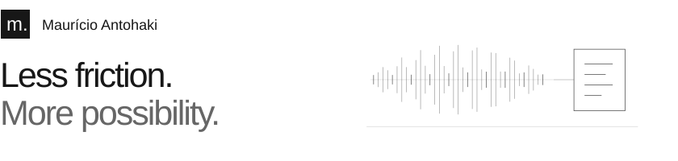
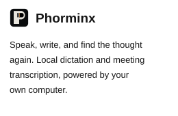
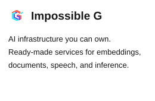
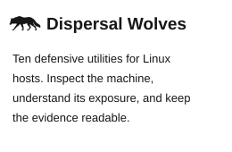
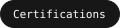
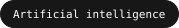
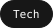

<picture><source media="(prefers-color-scheme: dark)" srcset="assets/header-dark.svg"></picture>

Leader · Architect · Polyglot

I like making complicated things usable. I build local AI tools, software that connects systems, and infrastructure people can run themselves. I lead the work and write the code.

<a href="https://antohaki.tech"><picture><source media="(prefers-color-scheme: dark)" srcset="assets/portfolio-dark.svg"></picture></a>

<picture><source media="(prefers-color-scheme: dark)" srcset="assets/divider-dark.svg"></picture>

### 01 / Selected work

<picture><source media="(max-width: 1199px)" srcset="assets/empty.svg" width="0" height="0"><source media="(prefers-color-scheme: dark)" srcset="assets/work-phorminx-panel-dark.svg"></picture><picture><source media="(max-width: 1199px)" srcset="assets/empty.svg" width="0" height="0"><source media="(prefers-color-scheme: dark)" srcset="assets/work-impossible-g-panel-dark.svg"></picture><picture><source media="(max-width: 1199px)" srcset="assets/empty.svg" width="0" height="0"><source media="(prefers-color-scheme: dark)" srcset="assets/work-dispersal-wolves-panel-dark.svg"></picture><a href="https://github.com/impossibleG/phorminx"><picture><source media="(max-width: 1199px)" srcset="assets/empty.svg" width="0" height="0"><source media="(prefers-color-scheme: dark)" srcset="assets/work-phorminx-github-dark.svg"></picture></a><a href="https://github.com/impossibleG"><picture><source media="(max-width: 1199px)" srcset="assets/empty.svg" width="0" height="0"><source media="(prefers-color-scheme: dark)" srcset="assets/work-impossible-g-github-dark.svg"></picture></a><a href="https://github.com/dispersal-wolves"><picture><source media="(max-width: 1199px)" srcset="assets/empty.svg" width="0" height="0"><source media="(prefers-color-scheme: dark)" srcset="assets/work-dispersal-wolves-github-dark.svg"></picture></a><a href="https://phorminx.net"><picture><source media="(max-width: 1199px)" srcset="assets/empty.svg" width="0" height="0"><source media="(prefers-color-scheme: dark)" srcset="assets/work-phorminx-website-dark.svg"></picture></a><a href="https://www.impossibleg.org/"><picture><source media="(max-width: 1199px)" srcset="assets/empty.svg" width="0" height="0"><source media="(prefers-color-scheme: dark)" srcset="assets/work-impossible-g-website-dark.svg"></picture></a><a href="https://dispersalwolves.com/"><picture><source media="(max-width: 1199px)" srcset="assets/empty.svg" width="0" height="0"><source media="(prefers-color-scheme: dark)" srcset="assets/work-dispersal-wolves-website-dark.svg"></picture></a><picture><source media="(min-width: 1200px)" srcset="assets/empty.svg" width="0" height="0"><source media="(prefers-color-scheme: dark)" srcset="assets/work-phorminx-panel-dark.svg"></picture><a href="https://github.com/impossibleG/phorminx"><picture><source media="(min-width: 1200px)" srcset="assets/empty.svg" width="0" height="0"><source media="(prefers-color-scheme: dark)" srcset="assets/work-phorminx-github-dark.svg"></picture></a><a href="https://phorminx.net"><picture><source media="(min-width: 1200px)" srcset="assets/empty.svg" width="0" height="0"><source media="(prefers-color-scheme: dark)" srcset="assets/work-phorminx-website-dark.svg"></picture></a><picture><source media="(min-width: 1200px)" srcset="assets/empty.svg" width="0" height="0"><source media="(prefers-color-scheme: dark)" srcset="assets/work-impossible-g-panel-dark.svg"></picture><a href="https://github.com/impossibleG"><picture><source media="(min-width: 1200px)" srcset="assets/empty.svg" width="0" height="0"><source media="(prefers-color-scheme: dark)" srcset="assets/work-impossible-g-github-dark.svg"></picture></a><a href="https://www.impossibleg.org/"><picture><source media="(min-width: 1200px)" srcset="assets/empty.svg" width="0" height="0"><source media="(prefers-color-scheme: dark)" srcset="assets/work-impossible-g-website-dark.svg"></picture></a><picture><source media="(min-width: 1200px)" srcset="assets/empty.svg" width="0" height="0"><source media="(prefers-color-scheme: dark)" srcset="assets/work-dispersal-wolves-panel-dark.svg"></picture><a href="https://github.com/dispersal-wolves"><picture><source media="(min-width: 1200px)" srcset="assets/empty.svg" width="0" height="0"><source media="(prefers-color-scheme: dark)" srcset="assets/work-dispersal-wolves-github-dark.svg"></picture></a><a href="https://dispersalwolves.com/"><picture><source media="(min-width: 1200px)" srcset="assets/empty.svg" width="0" height="0"><source media="(prefers-color-scheme: dark)" srcset="assets/work-dispersal-wolves-website-dark.svg"></picture></a>

<picture><source media="(prefers-color-scheme: dark)" srcset="assets/divider-dark.svg"></picture>

### 02 / Foundations & tools

<!-- Existing profile activity figures retained; not recalculated live. The private framework name is intentionally omitted. -->

<picture><source media="(prefers-color-scheme: dark)" srcset="assets/category-0-dark.svg"></picture>
<picture><source media="(prefers-color-scheme: dark)" srcset="assets/pill-0-dark.svg"></picture>
<picture><source media="(prefers-color-scheme: dark)" srcset="assets/pill-1-dark.svg"></picture>
<picture><source media="(prefers-color-scheme: dark)" srcset="assets/pill-2-dark.svg"></picture>
<picture><source media="(prefers-color-scheme: dark)" srcset="assets/pill-3-dark.svg"></picture>
<picture><source media="(prefers-color-scheme: dark)" srcset="assets/pill-4-dark.svg"></picture>
<picture><source media="(prefers-color-scheme: dark)" srcset="assets/pill-5-dark.svg"></picture>
<picture><source media="(prefers-color-scheme: dark)" srcset="assets/pill-6-dark.svg"></picture>
<picture><source media="(prefers-color-scheme: dark)" srcset="assets/pill-7-dark.svg"></picture>
<picture><source media="(prefers-color-scheme: dark)" srcset="assets/pill-8-dark.svg"></picture>
<picture><source media="(prefers-color-scheme: dark)" srcset="assets/category-1-dark.svg"></picture>
<picture><source media="(prefers-color-scheme: dark)" srcset="assets/pill-9-dark.svg"></picture>
<picture><source media="(prefers-color-scheme: dark)" srcset="assets/pill-10-dark.svg"></picture>
<picture><source media="(prefers-color-scheme: dark)" srcset="assets/pill-11-dark.svg"></picture>
<picture><source media="(prefers-color-scheme: dark)" srcset="assets/pill-12-dark.svg"></picture>
<picture><source media="(prefers-color-scheme: dark)" srcset="assets/pill-13-dark.svg"></picture>
<picture><source media="(prefers-color-scheme: dark)" srcset="assets/pill-14-dark.svg"></picture>
<picture><source media="(prefers-color-scheme: dark)" srcset="assets/pill-15-dark.svg"></picture>
<picture><source media="(prefers-color-scheme: dark)" srcset="assets/pill-16-dark.svg"></picture>
<picture><source media="(prefers-color-scheme: dark)" srcset="assets/category-2-dark.svg"></picture>
<picture><source media="(prefers-color-scheme: dark)" srcset="assets/pill-17-dark.svg"></picture>
<picture><source media="(prefers-color-scheme: dark)" srcset="assets/pill-18-dark.svg"></picture>
<picture><source media="(prefers-color-scheme: dark)" srcset="assets/pill-19-dark.svg"></picture>
<picture><source media="(prefers-color-scheme: dark)" srcset="assets/pill-20-dark.svg"></picture>
<picture><source media="(prefers-color-scheme: dark)" srcset="assets/pill-21-dark.svg"></picture>
<picture><source media="(prefers-color-scheme: dark)" srcset="assets/pill-22-dark.svg"></picture>
<picture><source media="(prefers-color-scheme: dark)" srcset="assets/pill-23-dark.svg"></picture>
<picture><source media="(prefers-color-scheme: dark)" srcset="assets/pill-24-dark.svg"></picture>
<picture><source media="(prefers-color-scheme: dark)" srcset="assets/pill-25-dark.svg"></picture>
<picture><source media="(prefers-color-scheme: dark)" srcset="assets/pill-26-dark.svg"></picture>
<picture><source media="(prefers-color-scheme: dark)" srcset="assets/category-3-dark.svg"></picture>
<picture><source media="(prefers-color-scheme: dark)" srcset="assets/stat-0-dark.svg"></picture>
<picture><source media="(prefers-color-scheme: dark)" srcset="assets/stat-1-dark.svg"></picture>
<picture><source media="(prefers-color-scheme: dark)" srcset="assets/stat-2-dark.svg"></picture>
<picture><source media="(prefers-color-scheme: dark)" srcset="assets/stat-3-dark.svg"></picture>

<picture>
  <source media="(prefers-color-scheme: dark)" srcset="https://github-readme-streak-stats.herokuapp.com/?user=autoantohaki&amp;hide_border=true&amp;disable_animations=true&amp;background=FFFFFF00&amp;stroke=444444&amp;ring=999999&amp;fire=999999&amp;currStreakNum=EDEDED&amp;sideNums=EDEDED&amp;currStreakLabel=999999&amp;sideLabels=999999&amp;dates=999999">
  
</picture>

[Explore the work](https://antohaki.tech) · [Start a conversation](https://antohaki.tech/#contact)
